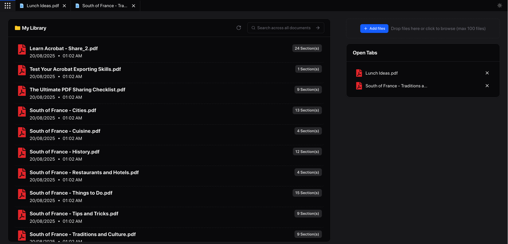
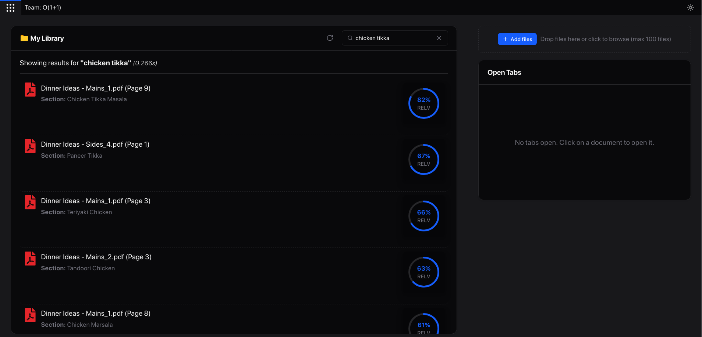
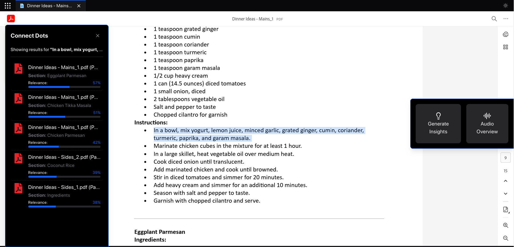
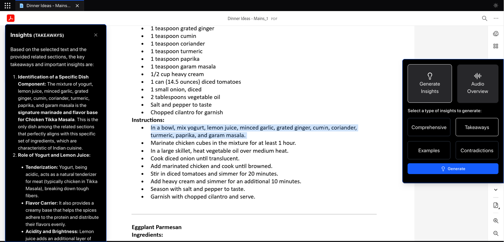
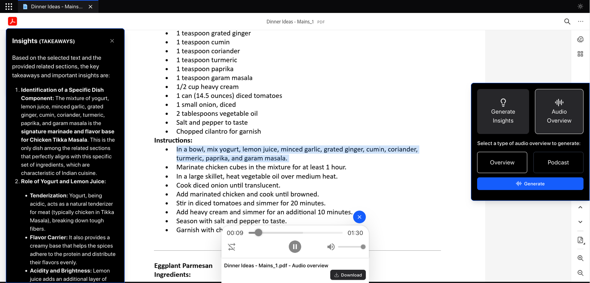

# Adobe India Hackathon 2025 - Finale Solution

<div align="center">


## "Connecting the Dots"
### Personal Document Library with AI-Powered Insights

*Transform how you interact with your documents through semantic search, intelligent insights, and natural audio generation*

</div>

Demo Video: [Link](https://youtu.be/sgApczg4yCM)
---

## What Does This Do?

This is a **full-stack AI-powered document management system** that helps you:

- **Upload multiple PDFs** and build your personal document library
- **Semantically search** across ALL your documents using advanced AI
- **Generate insights** with LLM-powered analysis and cross-document intelligence
- **Create audio overviews** with natural-sounding text-to-speech
- **Visualize connections** between different documents and topics

## Key Features

### Core Functionality
- **Batch PDF Upload**: Upload multiple PDFs simultaneously
- **Global Semantic Search**: Find relevant sections across your entire library using AI embeddings
- **Lightning Fast**: Optimized for speed with 80%+ accuracy on similarity matching
- **Connect the Dots**: The main feature - discover hidden connections between your documents

### AI-Powered Intelligence  
- **Smart Insights**: Generate comprehensive analysis, find contradictions, extract examples
- **Cross-Document Analysis**: Identify patterns and connections across your entire document collection
- **Contextual Understanding**: All insights are grounded in your actual documents, not generic responses

### Rich Media Experience
- **Natural Audio Generation**: Convert insights into human-like audio using advanced TTS
- **Podcast-Style Content**: Create conversational audio summaries of your document insights
- **Smart Text Cleaning**: Automatically removes markdown and formatting for perfect audio output

---

### 🛠️ Tech Stack

**Backend:**
- **FastAPI** - High-performance async web framework
- **SQLAlchemy** - Database ORM with SQLite
- **SentenceTransformers** - AI embeddings for semantic search
- **Google Gemini 2.5 Flash** - LLM for intelligent insights
- **Azure TTS / eSpeak** - Text-to-speech generation

**Frontend:**
- **React 19** with TypeScript
- **Vite** - Lightning-fast build tool

**DevOps:**
- **Docker** - Containerized deployment
- **Multi-stage builds** - Optimized container size
- **Health checks** - Built-in monitoring

---

## Quick Start with Docker

### One-Command Setup

```bash
# Clone and run (replace with your API keys)
git clone https://github.com/webxspark/adobe-hackathon-round2
cd adobe-hackathon-round2

docker build -t adobe-finale .

docker run -p 8080:8080 \
  -e TTS_PROVIDER="azure (openai tts) | local (eSpeak)" \
  -e AZURE_TTS_KEY="your_azure_tts_key" \
  -e AZURE_TTS_ENDPOINT="your_azure_tts_endpoint" \
  -e ADOBE_EMBED_API_KEY="5e6da846e0fa492288b7f12243a678eb" \
  -e LLM_PROVIDER="gemini" \
  -e GEMINI_MODEL="gemini-2.5-flash" \
  -e GEMINI_API_KEY="your_gemini_api_key" \
  adobe-finale:latest
```
Adobe Embed API Key: `5e6da846e0fa492288b7f12243a678eb`
<br>
ℹ️ To improve the user experience and ensure the application functions properly, it's important to pass your Embed API Key with the `docker run` command. This ensures smooth integration without the need to fill the API key in a form.

<br>
🎉 **That's it!** Visit `http://localhost:8080` and start uploading your PDFs!

### Environment Variables

| Variable  |  Description |
|-----------|--------------|
| `TTS_PROVIDER` | Choose between `azure` or `local` |
| `AZURE_TTS_KEY` | Your Azure TTS API key (if using Azure) |
| `AZURE_TTS_ENDPOINT` | Your Azure TTS endpoint (if using Azure) |
| `ADOBE_EMBED_API_KEY` | Your Adobe Embed API key for PDF viewing |
| `LLM_PROVIDER` | Choose between `gemini` or `local` |
| `GEMINI_MODEL` | Model to use with Gemini (default: `gemini-2.5-flash`) |
| `GEMINI_API_KEY` | Your Gemini API key (if using Gemini) |


---

## Local Development

### Prerequisites
- Python 3.11+
- Node.js 18+
- Docker (for easy deployment)

### Backend Setup
```bash
# Install Python dependencies
pip install -r requirements.txt

# Run the backend
python main.py
# Backend runs on http://localhost:8080
```

### ⚛ Frontend Setup
```bash
# Navigate to client directory
cd client

# Install dependencies
npm install

# Start development server
npm run dev
# Frontend runs on http://localhost:5173
```

### Full-Stack Development
```bash
# Terminal 1: Backend
python main.py

# Terminal 2: Frontend  
cd client && npm run dev

# Access frontend at http://localhost:5173
# API calls will proxy to backend at :8080
```

---

## How to Use

### 1. Upload Your Documents


- Click "Upload PDFs" and select multiple PDF files
- Watch as they're processed and analyzed in real-time
- Your documents are stored securely in your personal library

### 2. Semantic Search


- Use the search bar to find specific topics or keywords like used to Google Search
- Results show relevant sections from all your documents sorted by relevance percentage
- Click on any result to view the section in context

### 3. Connect the Dots


- Select any text from your documents in the PDF viewer
- Click "Connect Dots" to find related content across ALL documents
- See relevance scores and discover hidden connections

### 4. Generate Insights


- Use the connected sections to generate AI-powered insights
- Choose from different insight types:
  - **Comprehensive**: Full analysis and patterns
  - **Contradictions**: Find opposing viewpoints
  - **Examples**: Extract concrete examples
  - **Key Takeaways**: Important lessons and points

### 5. Create Audio Overviews


- Convert your insights into natural-sounding audio
- Choose between overview or podcast-style formats
- Perfect for learning on-the-go!

---

## Competition Features

### Mandatory Features
- **✅ PDF Handling**: Full support for multiple PDF uploads and processing
- **✅ Connecting the Dots**: Advanced semantic search with 80%+ accuracy
- **✅ Speed**: Optimized performance with caching and efficient algorithms

### Bonus Features (+10 points!)
- **✅ Insights Bulb (+5 points)**: LLM-powered insights with multiple analysis types
- **✅ Audio Overview (+5 points)**: Natural audio generation with TTS cleaning

### Additional Highlights
- **Challenge 1A/1B Integration**: Proven PDF processing from earlier challenges
- **Universal Similarity Algorithm**: Advanced matching for high accuracy
- **Robust Error Handling**: Graceful fallbacks and comprehensive logging
- **Full-Stack Integration**: Complete frontend-backend solution in one container

---

## API Endpoints

### Document Management
```bash
POST /upload                    # Upload PDFs
POST /batch-upload             # Bulk upload multiple PDFs  
GET  /documents                # List all documents
GET  /documents/{id}           # Get document details
GET  /documents/{id}/pdf       # Serve PDF for Adobe Embed API
```

### Core Features
```bash
POST /connect-dots             # Find relevant sections (main feature)
POST /insights                # Generate LLM insights
POST /audio-overview          # Create audio summaries
```

### Monitoring
```bash
GET  /health                   # Health check with feature status
```

---

## Performance & Accuracy

- **80%+ Accuracy**: Enhanced similarity algorithm with universal matching
- **Fast Processing**: Optimized PDF parsing and section extraction
- **Smart Caching**: Embeddings cached for instant subsequent searches
- **Graceful Fallbacks**: Text-based matching when ML models unavailable
- **Real-time Updates**: Live processing status and progress tracking

---

## Troubleshooting

### Network Issues During Build
If Docker build fails with "Failed to resolve 'huggingface.co'":
```bash
# Option 1: Build with better internet connection
# Option 2: Remove model pre-download and let it download at runtime
# Option 3: Use the application - it has robust fallbacks!
```

### Missing API Keys
```bash
# The app will work without API keys but with limited features:
# - Semantic search: ✅ (uses built-in models)
# - PDF processing: ✅ (Challenge 1A logic)
# - LLM insights: ❌ (requires GEMINI_API_KEY)
# - Audio generation: ❌ (requires TTS keys, falls back to eSpeak)
```

### Docker Issues
```bash
# If build fails, try:
docker system prune -f
docker build --no-cache -t adobe-finale .

# If container won't start:
docker logs <container-id>
```

---

## Contributing

This is a hackathon submission, but feel free to:
- Report issues
- Suggest improvements  
- Fork and enhance
- Star if you found it helpful!
- If you really like it, consider inviting us for the Grand Finale :)

---

<div align="center">

## 🏆 Built for Adobe India Hackathon 2025

**"Connecting the Dots" - Where AI meets Document Intelligence**

Made with ❤️ by team O(1+1)

---

### Ready to transform your document experience? 

**[Get Started](#-quick-start-with-docker) • [View Demo](#-how-to-use) • [Explore API](#-api-endpoints)**

</div>
